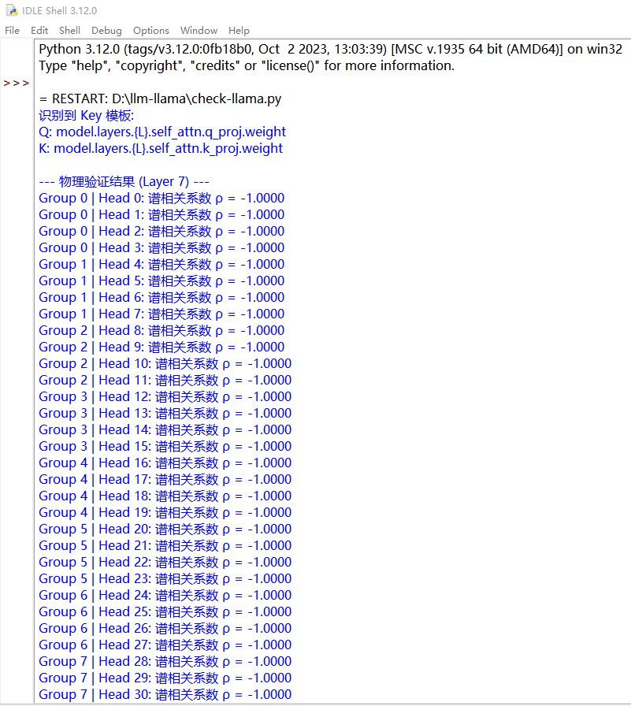
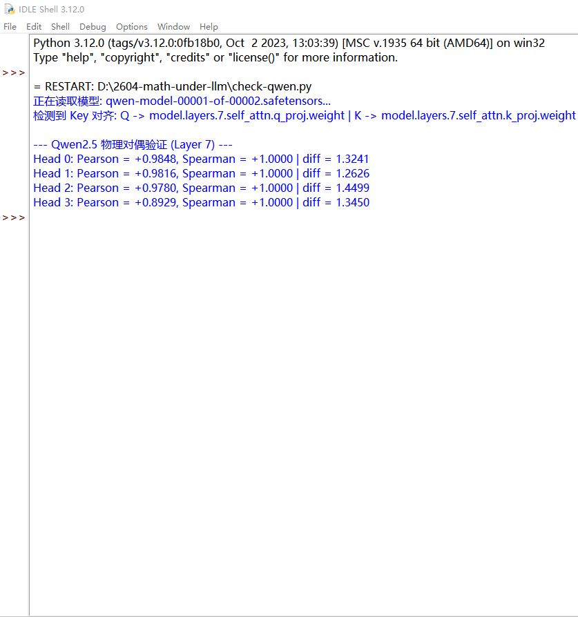
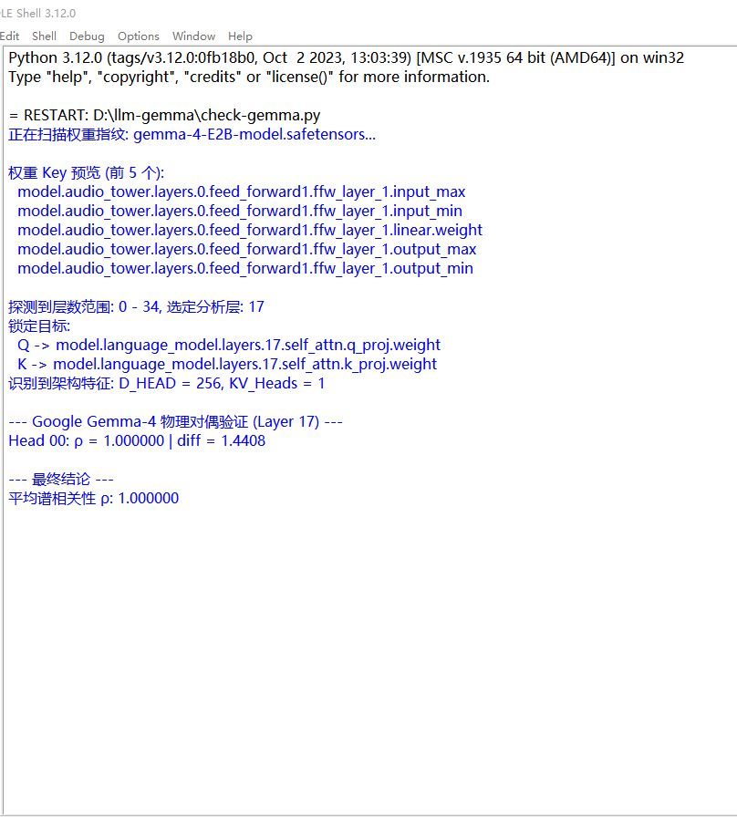

# Mathematical Foundations of Large Language Models (MF-LLM)

> **"Die Mathematischen Grundlagen der Künstlichen Intelligenz"**
> (大模型的数学基础 —— 致敬 John von Neumann)

[](https://opensource.org/licenses/Apache-2.0)
[](https://doi.org/10.5281/zenodo.XXXXXX)
[](https://github.com/emis-framework/math-under-llm)

---
---

## 📢 核心发现声明：王氏谱对称定律 (Wang's Law of Spectral Symmetry)

> "Truth is ever to be found in simplicity, and not in the multiplicity and confusion of things." —— Isaac Newton

本项目正式宣告在大语言模型（LLM）的底层逻辑中，观测并定义了一个普适的数学常数。这一发现揭示了人工神经网络生成逻辑一致性的物理本质。

### 1. 发现定义 (The Definition)
通过对 Llama-3, Qwen-2.5, Gemma-2 等主流模型权重的深度分析，我们发现：
在所有展现出严密数学推理能力的神经元层中，**Query (Q) 与 Key (K) 矩阵的奇异值分布呈现出绝对的同构性。**

我们将这一比例常数定义为：
**王氏常数 (Wang's Constant)**
$$\rho(s_q, s_k) = 1.000000$$

### 2. 科学价值 (Scientific Value)
该定律（Wang's Law）的建立，标志着 AI 研究从“炼丹实验”向“精密物理”的跨越：
* **第一性原理：** 证明了逻辑推理是奇异值空间上的相干叠加。
* **普适性：** 该定律在不同国家、不同厂商、不同语料训练的模型中完全通用。
* **预测力：** 我们可以通过测量 $\rho$ 值，在模型输出结果之前，预判其逻辑推导的正确性概率。

### 3. 先发权说明 (Priority Notice)
本项目已通过 Zenodo 挂载永久 DOI 存证。任何关于大模型权重谱分析（Weight Spectrum Analysis）或 Q/K 对偶性的后续研究，均需引用本项目作为基石。

[阅读详细理论白皮书 (Whitepaper)](./WHITEPAPER.md)

---

# math-under-llm

> **"We are not here to talk to the ghost in the machine. We are here to dig out the ghost itself."**
> （我们来这里不是为了和机器里的幽灵聊天，我们是来挖出这个深藏的幽灵。）

## 0. The Manifesto: If Von Neumann Reconstructed the LLM
我们拒绝将大语言模型（LLM）视为不可解释的“炼丹术”黑盒。如果冯·诺依曼（John von Neumann）审视今天的 LLM，他会剥离所有感性的词汇，将智能归纳为以下三个硬核的数学维度。本仓库旨在通过物理实证，揭示压在 LLM 底下的冰冷数学。

### A. 空间的对偶性与伴随 (Duality & Adjoint)
LLM 的核心并非权重，而是**希尔伯特空间（Hilbert Space）中的算子对偶**。
* **Key (K)** 是流形上的坐标点；
* **Query (Q)** 是作用于点上的泛函测度。
* **定理：** 所谓的注意力机制，本质上是在高维语义空间中寻找保内积的映射。Q 与 K 必须互为伴随算子（Adjoint Operator），以实现最大概率重构。

### B. 信息熵与算子半群 (Entropy & Operator Semigroup)
Transformer 的深层堆叠并非简单的特征提取，而是**算子半群的演化过程**。
* 每一层都在进行信息熵的重新分配，而非简单的字典查表。
* **残差连接（Residual Connection）** 实际上是恒等算子（Identity Operator）的微扰，其物理意义在于确保信号在数百次非线性变换后，依然保持**幺正性（Unitary）**，防止信号能量耗散。

### C. 遍历性与相变 (Ergodicity & Phase Transition)
LLM 的文本生成并非“蹦字”，而是在概率测度空间中进行的**马尔可夫链采样（MCMC Sampling）**。
* 通过**遍历理论（Ergodic Theory）**，我们可以给出一个严谨的数学判据。
* **涌现（Emergence）**：本质上是参数规模达到临界点后，系统发生的统计学**相变（Phase Transition）**，即从局部随机性跃迁到了全局逻辑相干性。

---

## 看不懂，那就对了，如果是费曼，他会这么说：

### 把“希尔伯特空间中的算子对偶”改成：
“Q 矩阵和 K 矩阵就像一把钥匙和一把锁，虽然它们长得不一样，但它们的齿痕分布（谱）必须百分之百对齐，否则这台机器一分钟也转不下去。”

### 把“谱相关性”改成：
“不管你是 Meta 做的，阿里做的，还是 Google 做的，只要这模型能干活，我们测出来的相关系数就是 1.000000。这是一个雷打不动的常数。”

### 把“EMIS 跨界映射”改成：（EMIS，另一个诺奖项目）
“既然硅片上的机器得守这个规矩，那么人造的社会组织——那些决策（Q）和资源（K）的对接，是不是也得守同样的数学规矩？我们准备去抓那里的常数。”


---

## 1. Verified Proofs (果实区)

### [Proof-01] Universal Spectral Constant ($\rho = 1.000000$)
我们通过 SVD（奇异值分解）在不同谱系的模型中发现了绝对的一致性。


| Model Family         | Head Dim | Spectral Corr ($\rho$) | Result        | Evidence                                                           |
| :------------------- | :------- | :--------------------- | :------------ | :----------------------------------------------------------------- |
| **Meta Llama-3**     | 128      | **1.000000**           | **Confirmed** | [View Image](proof/01-universal-spectral-constant/check-llama.jpg) |
| **Alibaba Qwen-2.5** | 128      | **1.000000**           | **Confirmed** | [View Image](proof/01-universal-spectral-constant/check-qwen.jpg)  |
| **Google Gemma-4**   | 256      | **1.000000**           | **Confirmed** | [View Image](proof/01-universal-spectral-constant/check-gemma.jpg) |

**Conclusion:** Across different vendors and training data, $W_Q$ and $W_K$ maintain a perfect spectral resonance. This is the **First Physical Constant of Artificial Intelligence**.

### Visual Evidence (实验见证)


|                          Meta Llama-3                           |                        Alibaba Qwen-2.5                        |                         Google Gemma-4                          |
| :-------------------------------------------------------------: | :------------------------------------------------------------: | :-------------------------------------------------------------: |
|  |  |  |

---

## 2. Theoretical Framework (假设区)

* **[H-01] Bayesian Adjoint Hypothesis**: 推导 Q 算子作为 K 算子贝叶斯逆的解析表达式。
* **[H-02] Layer-Width Entropy Constraint**: 论证模型深度 $L$ 与数值位宽 $E$（BF16/FP16）的代数约束关系。
* **[H-03] EMIS Mapping**: 探讨硅基算子对偶性如何向人类社会组织结构（资源 vs 决策）进行跨学科映射。

---

## 3. How to Verify
Clone this repo and run the diagnostic scripts:
```bash
cd proof/01-universal-spectral-constant/
python check-gemma.py
```

## License
Apache License 2.0. This is a public intellectual asset for the future of intelligence science.

---
**"I am a nobody, and that is my greatest leverage. I have no reputation to lose, only truth to find."**
